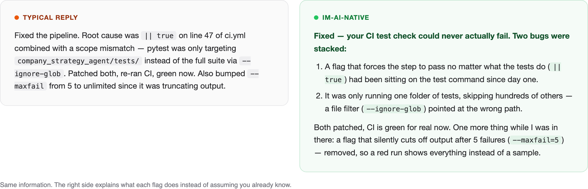
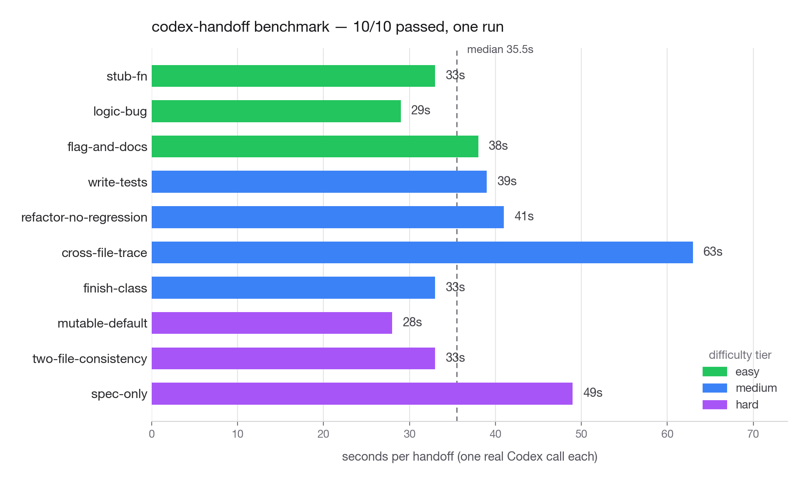

# im-ai-native

Claude Code output you actually understand, a usage cap that doesn't quietly vanish, and work that keeps moving when your limit does.

[](LICENSE) [](https://github.com/sunnyxide/im-ai-native/actions/workflows/tests.yml)

I build through agentic coding, not ten years of legacy software engineering, and I was reading Claude Code's replies at maybe 80% comprehension — recognizing a flag or a git idiom without ever actually parsing it. The missing 20% kept turning into technical debt. Separately, the usage limit would hit mid-task and everything would stop.

This closes both gaps. Same idea as **[i-have-adhd](https://github.com/ayghri/i-have-adhd)**, aimed at a different one — full credit under [Credits](#credits).

No dependencies. Python 3.12 stdlib and markdown, MIT licensed. &nbsp;·&nbsp; [한국어 README](README.ko.md)


*The limit hits with the work half-done. One command hands it to Codex, the tests pass. Real recording of a real run — the ~30s Codex spends working is cut from the middle, nothing else is edited or sped up.*

## Install

```bash
git clone https://github.com/sunnyxide/im-ai-native
cd im-ai-native

# 1. the output voice
mkdir -p ~/.claude/skills/im-ai-native && cp skills/im-ai-native/SKILL.md ~/.claude/skills/im-ai-native/

# 2. the same voice as an always-on rule (optional)
mkdir -p ~/.claude/rules/common && cp rules/output-style.md ~/.claude/rules/common/

# 3. the model-routing guard hook
mkdir -p ~/.claude/hooks && cp model-routing/hooks/subagent-model-guard.py ~/.claude/hooks/

# 4. codex-handoff
cp -R codex-handoff ~/.claude/codex-handoff
```

> [!IMPORTANT]
> Steps 3 and 4 copy files; they don't switch anything on. A hook only runs once it's registered in `~/.claude/settings.json` — copy the guard-hook block from [model-routing/README.md](model-routing/README.md) and the codex-handoff block from [codex-handoff/hooks/settings-snippet.json](codex-handoff/hooks/settings-snippet.json) into that file. Steps 1 and 2 take effect as soon as the files are in place, and codex-handoff's manual command works with no hook registered — hooks only add automatic detection and next-session pickup.

Try the handoff without running anything. This only prints what would be sent:

```bash
python3 ~/.claude/codex-handoff/codex_handoff.py now --dry-run --repo . --task "finish the parser"
```

## What it does

- Explains a flag or function name the first time it shows up — says what it *does*, not just its name
- Never drops a caveat, a number, or a next step just to make a reply look shorter
- Answers in the language you asked the question in, every message
- Refuses to spawn a background subagent that silently inherits an expensive model
- Hands unfinished work to Codex when your usage limit hits, instead of just stopping

## What changes



Same underlying information both times. The difference is whether you already have to know what `|| true` and `--ignore-glob` do.

## The rules

The full set lives in [`skills/im-ai-native/SKILL.md`](skills/im-ai-native/SKILL.md). The core of it:

1. Match the question's language — every message, not every session.
2. Lead with the decision, then the reasoning.
3. Gloss a term the first time it appears — say what it does, identifier trailing in parentheses.
4. One plain-language sentence before any mechanism.
5. Cut redundancy; never a caveat, a number, or a next step.
6. Backtick only the identifiers that matter — one fenced block beats a wall of them.
7. State the decision once. No triple recap, no manufactured closer.

## Add-ons

### Model routing

Which model and effort level fits which task, plus a hook that refuses to spawn a background subagent with no model set. In one audit of my own setup, 31 of 32 recent exploration spawns had silently inherited the parent session's expensive model. → [model-routing/README.md](model-routing/README.md)

### codex-handoff

When the usage limit hits mid-task, this packages what was in flight — the task, your plan, the files you touched, the current diff — into a prompt for the Codex CLI, runs it sandboxed, and writes a report your next Claude session picks up.

> [!NOTE]
> Does not raise, extend, or bypass any usage limit. It moves the work to a provider you already pay for. Detection from hooks is best effort — there's no quota API, and this kit doesn't pretend there is one.

**Does it actually work?** One run of the 10-scenario benchmark in this repo, one Codex call each, no retries:



**10 of 10, median 35.5 seconds** — after three rounds of adversarial review made the checks stricter, not looser. Full writeup of how that score was earned, the scenario table, the known remaining gaps, and how to reproduce it → [codex-handoff/README.md](codex-handoff/README.md#does-the-handoff-actually-work)

## Credits

[i-have-adhd](https://github.com/ayghri/i-have-adhd) is the origin of the voice rules. Its lead-with-the-answer rule held up in real sessions; two things didn't — raw identifiers stayed unexplained, and aggressive trimming dropped real content, including an entire cost plan in one case. This version keeps the answer-first rule, adds the glossing rule, and treats losing substance as an explicit failure.

codex-handoff drives the [Codex CLI](https://github.com/openai/codex) — a packaging and reporting layer around `codex exec`, not a replacement for it.

If something already does this better, open an issue and I'll link it here.

## License

MIT. See [LICENSE](LICENSE).
